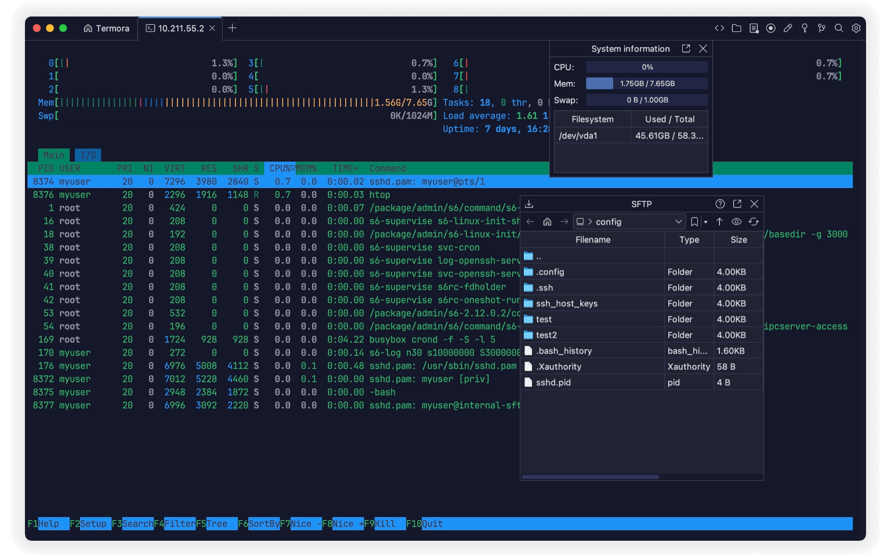
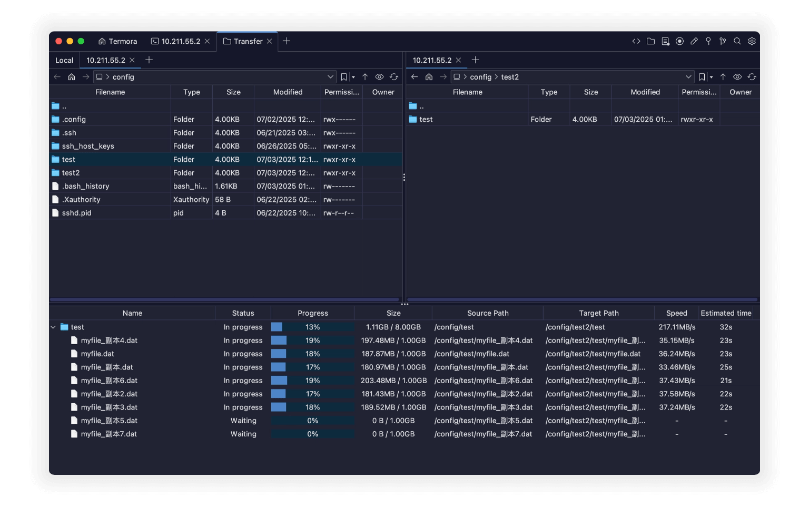
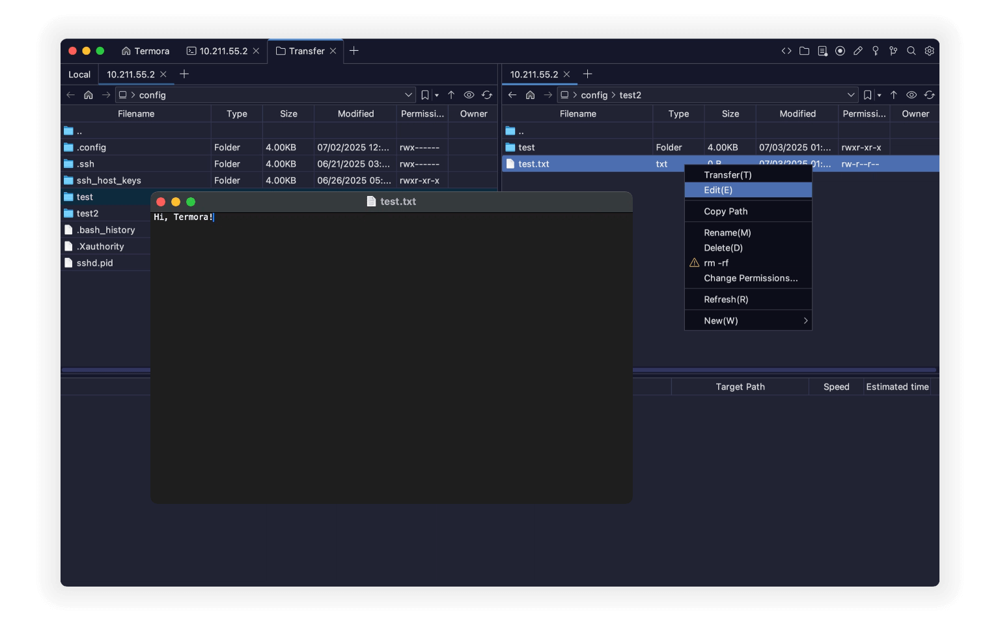
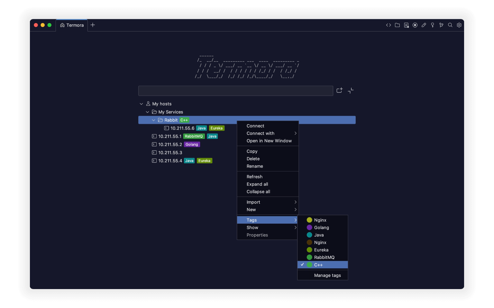

<a href="./README.md">English</a> | <a href="./README.de_DE.md">Deutsch</a> | <a href="./README.zh_CN.md">简体中文</a>

# Termora

**Termora** é um emulador de terminal e cliente SSH multiplataforma, disponível para **Windows, macOS e Linux**.

  

O Termora é desenvolvido utilizando [**Kotlin/JVM**](https://kotlinlang.org/) e implementa parcialmente o [**protocolo de sequência de controle XTerm**](https://invisible-island.net/xterm/ctlseqs/ctlseqs.html). Seu objetivo de longo prazo é alcançar **suporte total a plataformas** (incluindo Android, iOS e iPadOS) via [**Kotlin Multiplatform**](https://kotlinlang.org/docs/multiplatform.html).

## ✨ Recursos

- 🧬 Suporte multiplataforma
- 🔐 Gerenciador de chaves integrado
- 🖼️ Encaminhamento X11 (X11 forwarding)
- 🧑‍💻 Integração com SSH-Agent
- 💻 Exibição de informações do sistema
- 📁 Gerenciamento de arquivos SFTP via interface gráfica (GUI)
- 📊 Monitoramento de uso de GPU Nvidia
- ⚡ Atalhos de comandos rápidos

## 🚀 Transferência de Arquivos

- Transferências diretas entre servidor A ↔ B
- Suporte a pastas recursivas
- Até **6 tarefas de transferência simultâneas**

  

## 📝 Edição de Arquivos

- Upload automático após editar e salvar
- Renomear arquivos e pastas
- Exclusão rápida de pastas grandes (suporte a `rm -rf`)
- Edição visual de permissões
- Criação de novos arquivos e pastas

  

## 💻 Hosts

- Estrutura hierárquica em árvore, semelhante a pastas
- Atribuição de tags para hosts individuais
- Importação de hosts de outras ferramentas
- Abertura direta com a ferramenta de transferência

  

## 🧩 Plugins

- 🌍 Geo: Exibe a geolocalização dos hosts
- 🔄 Sync: Sincroniza configurações para Gist ou WebDAV
- 🗂️ WebDAV: Conecta a armazenamentos WebDAV
- 📝 Editor: Editor de arquivos SFTP integrado
- 📡 SMB: Conecta ao [SMB](https://pt.wikipedia.org/wiki/Server_Message_Block)
- ☁️ S3: Conecta ao armazenamento de objetos S3
- ☁️ Huawei OBS: Conecta ao Huawei Cloud OBS
- ☁️ Tencent COS: Conecta ao Tencent Cloud COS
- ☁️ Alibaba OSS: Conecta ao Alibaba Cloud OSS
- 👉 [Ver todos os plugins...](https://www.termora.app/plugins)

## 📦 Download

- 🧾 [Último Lançamento (Release)](https://github.com/TermoraDev/termora/releases/latest)
- 🍺 **Homebrew**: `brew install --cask termora`
- 🔨 **WinGet**: `winget install termora`
-  <b>Microsoft Store</b>: <a href="https://apps.microsoft.com/store/detail/9NRZBHG43SB9?cid=DevShareMCLPCS">Visite o Termora na Microsoft Store</a>

## 🛠️ Desenvolvimento

Recomendamos o uso do JDK [JetBrainsRuntime](https://github.com/JetBrains/JetBrainsRuntime) para o desenvolvimento.

- Executar localmente: `./gradlew :run`

## 📄 Licença

Este software é distribuído sob um modelo de licença dupla. Você pode escolher uma das seguintes opções:

- **AGPL-3.0**: Use, distribua e modifique o software sob os termos da [AGPL-3.0](https://opensource.org/license/agpl-v3).
- **Licença Proprietária**: Para uso em código fechado ou comercial, entre em contato com o autor para obter uma licença comercial.
