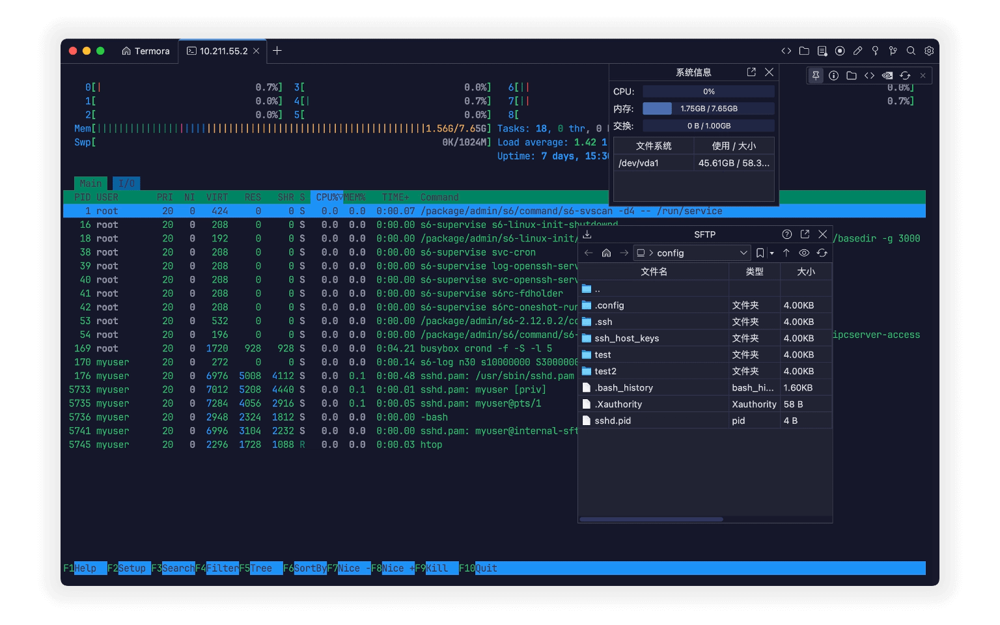
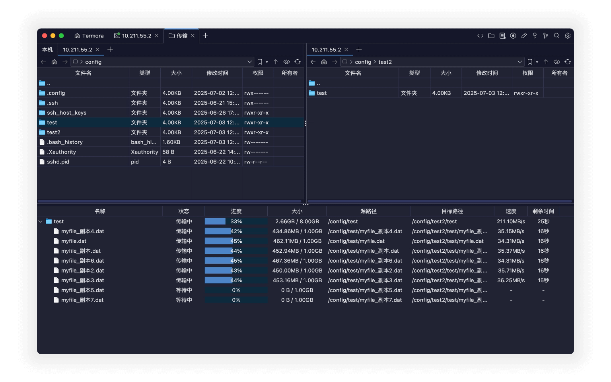
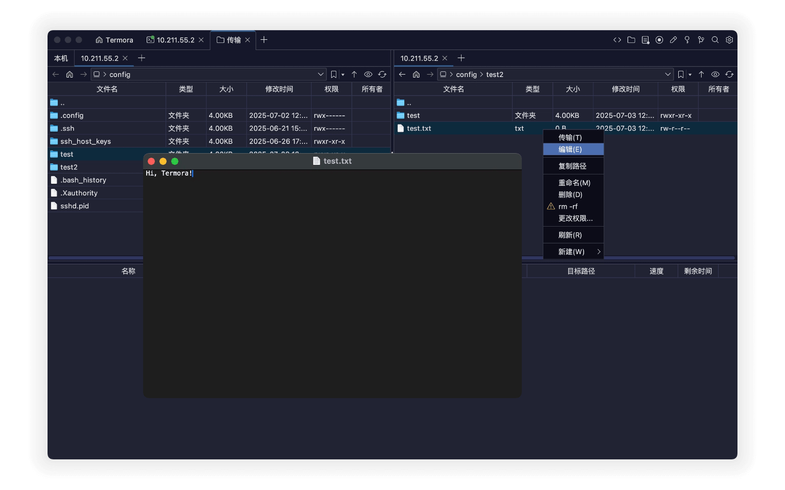
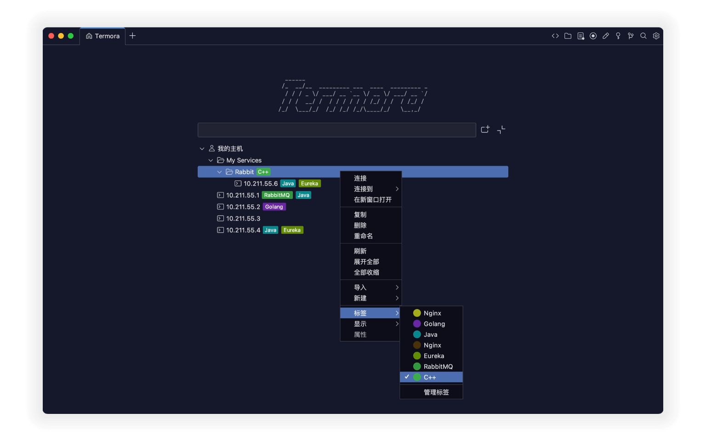

<a href="./README.md">English</a> | <a href="./README.de_DE.md">Deutsch</a> | <a href="./README.pt_BR.md">Português (Brasil)</a>

# Termora

**Termora** 是一款跨平台终端模拟器和 SSH 客户端，支持 **Windows、macOS、Linux**。

  

Termora 使用 [**Kotlin/JVM**](https://kotlinlang.org/) 开发，支持（正在实现中） [**XTerm 控制序列协议**](https://invisible-island.net/xterm/ctlseqs/ctlseqs.html)。未来目标是借助 [**Kotlin Multiplatform**](https://kotlinlang.org/docs/multiplatform.html) 实现 **全平台支持**，包括 Android、iOS、iPadOS 等。

## ✨ 功能特性

- 🧬 跨平台运行
- 🔐 内建密钥管理器
- 🖼️ 支持 X11 转发
- 🧑‍💻 SSH-Agent 集成
- 💻 系统信息展示
- 📁 图形化 SFTP 文件管理
- 📊 Nvidia 显卡使用率查看
- ⚡ 快捷指令支持

## 🚀 文件传输

- 支持 A ↔ B 服务器间直接传输
- 文件夹递归复制支持
- 最多可同时运行 **6 个传输任务**

  

## 📝 文件编辑功能

- 保存后自动上传修改内容
- 文件 / 文件夹 重命名
- 快速删除大文件夹：`rm -rf` 支持
- 可视化更改权限
- 支持新建文件 / 文件夹

  

## 💻 主机

- 类似文件夹树形结构
- 给主机添加标签
- 从其它软件导入
- 使用传输工具打开

  

## 🧩 插件

- 🌍 Geo：显示主机位置信息
- 🔄 Sync：将配置同步至 Gist 或 WebDAV
- 🗂️ WebDAV：连接 WebDAV 对象存储
- 📝 Editor：内置 SFTP 文件编辑器
- 📡 SMB:  连接 [SMB](https://baike.baidu.com/item/smb/4750512) 文件共享协议
- ☁️ S3：连接 S3 对象存储
- ☁️ Huawei OBS：连接华为云对象存储
- ☁️ Tencent COS：连接腾讯云 COS
- ☁️ Alibaba OSS：连接阿里云 OSS
- 👉 [查看所有插件...](https://www.termora.cn/plugins)

## 📦 下载

- 🧾 [Latest release](https://github.com/TermoraDev/termora/releases/latest)
- 🍺 **Homebrew**：`brew install --cask termora`
- 🪟 **WinGet**：`winget install termora`
-  <b>Microsoft Store</b>: <a href="https://apps.microsoft.com/store/detail/9NRZBHG43SB9?cid=DevShareMCLPCS">Termora</a>

## 🛠️ 开发指南

建议使用 [JetBrainsRuntime](https://github.com/JetBrains/JetBrainsRuntime) JDK 运行环境。

- 本地运行：`./gradlew :run`

## 📄 授权协议

Termora 采用双重许可方式，您可以选择：

- **AGPL-3.0**：自由使用、修改、分发（遵循 [AGPL 条款](https://opensource.org/license/agpl-v3)）
- **专有许可**：如需闭源或商业用途，请联系作者获取授权  
